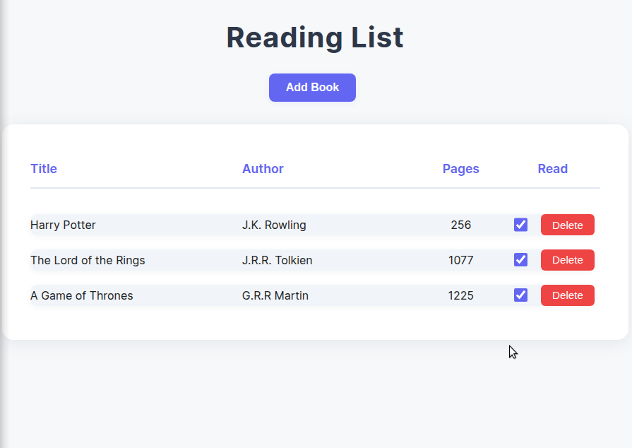

# Library

A simple JavaScript library app for managing your book collection. Add, remove, and update books with ease.

## Features

- Add new books with title, author, and read status
- Edit or remove books from your collection
- Mark books as read or unread
- Responsive user interface

## Usage

1. Clone this repository.
2. Open `index.html` in your browser.
3. Start adding books to your library!

## Example

See below for a screenshot of the app:

## Usage Note

Feel free to use, modify, and share this project however you like.
